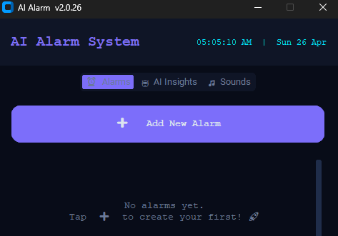
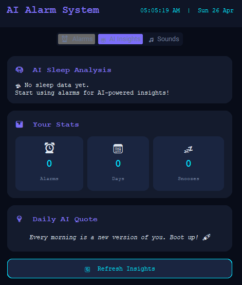

# 🤖 AI Alarm System

> A futuristic AI-powered alarm system built in Python — Voice Control, Smart Sounds & AI Sleep Insights.


---

##  Features

| Feature | Description |
|---|---|
|  **Voice Control** | Say "Snooze" or "Stop" to control alarms hands-free |
|  **5 Unique Sounds** | Neural Pulse, Digital Rain, Cosmic Wake, Cyber Beep, Quantum Bell |
|  **AI Sleep Analysis** | Smart pattern detection & sleep recommendations |
|  **Text-to-Speech** | AI announces your alarm label & morning message |
|  **AI Quotes** | Motivational AI-generated wake-up messages |
|  **Repeat Days** | Set alarms for specific weekdays or one-time |
|  **Smart Snooze** | 5-min snooze with snooze-count tracking |
|  **Stats Dashboard** | Track alarms, days, and snooze history |
|  **Dark UI** | Futuristic 2026-style dark theme with Courier font |

---

## 🚀 Quick Setup

### 1. Clone the repo
```bash
In New terminal 
cd ai-alarm-system
```

### 2. Create virtual environment
```bash
python -m venv venv

# Windows
venv\Scripts\activate

# Mac/Linux
source venv/bin/activate
```

### 3. Install dependencies
```bash
pip install -r requirements.txt
```

### 4. Run the app
```bash
python main.py
```

---

## 🎵 Alarm Sounds

| Sound | Description |
|---|---|
| ⚡ Neural Pulse | Ascending frequency burst |
| 🌧 Digital Rain | Matrix-style random digital droplets |
| 🌌 Cosmic Wake | Rising frequency space sweep |
| 🤖 Cyber Beep | Cyberpunk SOS urgent pattern |
| 🔔 Quantum Bell | Harmonic C-major overtone chime |

---

## 📁 Project Structure

```
ai-alarm-system/
├── main.py          ← Full application (single file)
├── alarms.json      ← Auto-created alarm storage
├── requirements.txt ← Python dependencies
└── README.md        ← You're reading this!
```

---

## 🛠️ Tech Stack

- **UI**: CustomTkinter (modern dark widgets)
- **Sound**: Pygame + NumPy (procedural sound generation)
- **AI Voice**: pyttsx3 (Text-to-Speech)
- **Voice Control**: SpeechRecognition + Google STT
- **Data**: JSON file storage

---

## 📸 Screenshots

> 
> 

---

## 🤝 Contributing

Pull requests welcome! Open an issue first to discuss changes.

---

## 📄 License

MIT License — free to use and modify.

---


